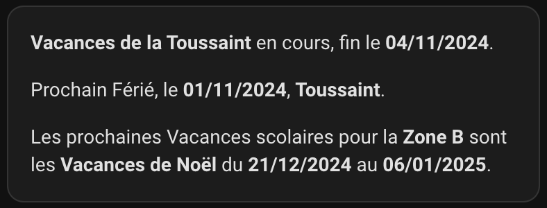
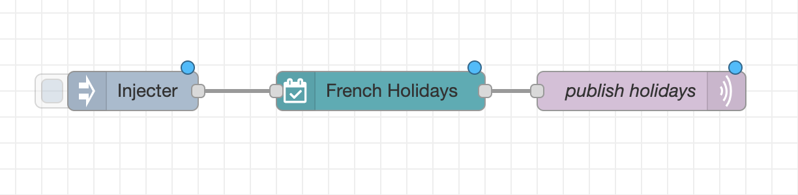

# node-red-french-holidays pour Node-RED

[English](README.md) | [Français](README.fr.md)

[](https://github.com/tataille/node-red-french-holidays/actions/workflows/node.js.yml)
[](https://github.com/tataille/node-red-french-holidays/graphs/commit-activity)
[](https://opensource.org/licenses/Apache-2.0)
[](https://github.com/tataille/node-red-french-holidays/issues)
[](https://www.npmjs.com/package/@tataille/node-red-french-holidays)

[](https://www.buymeacoffee.com/jeanmarctaz)

Un node [Node-RED](https://nodered.org) permettant de récupérer les jours fériés français et les périodes de vacances scolaires en fonction de l’académie et de la zone géographique sélectionnées.

Une connexion réseau est nécessaire afin de récupérer dynamiquement les données depuis les API officielles suivantes :

* <https://api.gouv.fr/documentation/jours-feries>
* <https://api.gouv.fr/documentation/api-calendrier-scolaire>


## Installation

Installez le module depuis le gestionnaire de palette de Node-RED.

Vous pouvez également exécuter la commande suivante dans le répertoire utilisateur de Node-RED, généralement `~/.node-red` :

```bash
npm install @tataille/node-red-french-holidays@X.X.X
```

### Mise à jour

Utilisez le gestionnaire de palette de Node-RED pour mettre à jour le module.


## Utilisation

Le node récupère les vacances scolaires et les jours fériés français en fonction de l’académie et de la zone géographique configurées, puis transmet le résultat au node suivant.

```json
[{"id":"f6f2187d.f17ca8","type":"tab","label":"Exemple Académie Rennes & Fériés Métropole","disabled":false,"info":""},{"id":"69a824ffaab0680b","type":"french-holidays","z":"f6f2187d.f17ca8","name":"Vacances","academy":"Rennes","geo":"Métropole","x":340,"y":240,"wires":[["821c23230cbef1e6"]]},{"id":"821c23230cbef1e6","type":"debug","z":"f6f2187d.f17ca8","name":"","active":true,"tosidebar":true,"console":false,"tostatus":false,"complete":"payload","targetType":"msg","statusVal":"","statusType":"auto","x":550,"y":240,"wires":[]},{"id":"d2702ce52d9c5d50","type":"inject","z":"f6f2187d.f17ca8","name":"","props":[{"p":"payload"}],"repeat":"","crontab":"","once":false,"onceDelay":0.1,"topic":"","payload":"test","payloadType":"str","x":130,"y":240,"wires":[["69a824ffaab0680b"]]}]
```

Les données sont retournées dans `msg.payload`.

Exemple de résultat obtenu pour l’académie de Clermont-Ferrand et la zone géographique Métropole :

```json
{
  "day": 5,
  "isPublicHoliday": false,
  "isTomorrowPublicHoliday": false,
  "publicHolidayName": null,
  "nextPublicHolidayName": "Lundi de Pâques",
  "nextPublicHolidayDate": "01/04/2024",
  "isSchoolHolidays": true,
  "schoolHolidaysEndDate": "03/03/2024",
  "isTomorrowSchoolHolidays": true,
  "schoolHolidaysName": "Vacances d'Hiver",
  "nextSchoolHolidaysCoutdownInDays": 49,
  "nextSchoolHolidaysCountdownInDays": 49,
  "nextSchoolHolidaysName": "Vacances de Printemps",
  "nextSchoolHolidaysStartDate": "12/04/2024",
  "nextSchoolHolidaysEndDate": "28/04/2024",
  "schoolPeriod": "2023-2024",
  "year": 2024,
  "region": "Métropole",
  "academy": "Clermont-Ferrand",
  "zones": "Zone A",
  "version": "1.2.9"
}
```

### Propriétés retournées

Le node retourne les propriétés suivantes dans `msg.payload` :

| Propriété | Type | Description |
|---|---|---|
| `day` | number | Jour actuel de la semaine : `0` pour dimanche jusqu’à `6` pour samedi |
| `isPublicHoliday` | boolean | Indique si le jour actuel est férié |
| `isTomorrowPublicHoliday` | boolean | Indique si le lendemain est férié |
| `publicHolidayName` | string | Nom du jour férié actuel, lorsqu’il existe |
| `nextPublicHolidayName` | string | Nom du prochain jour férié |
| `nextPublicHolidayDate` | string | Date du prochain jour férié au format `JJ/MM/AAAA` |
| `isSchoolHolidays` | boolean | Indique si le jour actuel se situe pendant les vacances scolaires |
| `isTomorrowSchoolHolidays` | boolean | Indique si le lendemain se situe pendant les vacances scolaires |
| `schoolHolidaysName` | string | Nom de la période de vacances scolaires actuelle |
| `schoolHolidaysEndDate` | string | Date de fin de la période de vacances scolaires actuelle |
| `nextSchoolHolidaysCountdownInDays` | number | Nombre de jours avant le début des prochaines vacances scolaires |
| `nextSchoolHolidaysName` | string | Nom de la prochaine période de vacances scolaires |
| `nextSchoolHolidaysStartDate` | string | Date de début des prochaines vacances scolaires |
| `nextSchoolHolidaysEndDate` | string | Date de fin des prochaines vacances scolaires |
| `schoolPeriod` | string | Année scolaire actuelle, par exemple `2026-2027` |
| `year` | number | Année civile actuelle |
| `region` | string | Zone géographique sélectionnée |
| `academy` | string | Académie française sélectionnée |
| `zones` | string | Zone de vacances scolaires associée à l’académie |
| `version` | string | Version installée du node |

> [!NOTE]
> À partir de la version `1.3.0`, utilisez la propriété correctement orthographiée `nextSchoolHolidaysCountdownInDays`.
>
> L’ancienne propriété mal orthographiée `nextSchoolHolidaysCoutdownInDays` reste disponible afin de préserver la compatibilité avec les flows Node-RED existants. Il est néanmoins recommandé de migrer progressivement vers le nouveau nom.

## Exemples

### Récupération quotidienne des données


```json
[{"id":"d88debded16f7c16","type":"switch","z":"59b8c1f4183c9197","name":"","property":"day-info.day","propertyType":"global","rules":[{"t":"eq","v":"0","vt":"str"},{"t":"eq","v":"6","vt":"str"},{"t":"else"}],"checkall":"false","repair":false,"outputs":3,"x":190,"y":580,"wires":[["08db052087e131ec"],["08db052087e131ec"],["7b2060ccee5932ce"]]}]
```

## Intégration avec Home Assistant

Voici un exemple d’intégration avec [Home Assistant](https://www.home-assistant.io/) utilisant MQTT et une carte Markdown.



### Flow Node-RED



```json
[
    {
        "id": "eca4106e44139140",
        "type": "tab",
        "label": "HASS French Holidays Integration",
        "disabled": false,
        "info": "",
        "env": []
    },
    {
        "id": "cb07494d2b31865d",
        "type": "french-holidays",
        "z": "eca4106e44139140",
        "name": "French Holidays",
        "academy": "Rennes",
        "geo": "Métropole",
        "x": 340,
        "y": 260,
        "wires": [
            [
                "767f764a21ed6daf"
            ]
        ]
    },
    {
        "id": "767f764a21ed6daf",
        "type": "mqtt out",
        "z": "eca4106e44139140",
        "name": "publish holidays",
        "topic": "home/holidays",
        "qos": "1",
        "retain": "true",
        "respTopic": "",
        "contentType": "application/json",
        "userProps": "",
        "correl": "",
        "expiry": "",
        "broker": "f5fe21bb87d5456d",
        "x": 540,
        "y": 260,
        "wires": []
    },
    {
        "id": "8050191babab6736",
        "type": "inject",
        "z": "eca4106e44139140",
        "name": "",
        "props": [],
        "repeat": "",
        "crontab": "",
        "once": false,
        "onceDelay": 0.1,
        "topic": "",
        "x": 150,
        "y": 260,
        "wires": [
            [
                "cb07494d2b31865d"
            ]
        ]
    },
    {
        "id": "f5fe21bb87d5456d",
        "type": "mqtt-broker",
        "name": "docker mosquitto",
        "broker": "mosquitto",
        "port": "1883",
        "tls": "",
        "clientid": "",
        "autoConnect": true,
        "usetls": false,
        "protocolVersion": "5",
        "keepalive": "60",
        "cleansession": true,
        "birthTopic": "",
        "birthQos": "0",
        "birthPayload": "",
        "birthMsg": {},
        "closeTopic": "",
        "closeQos": "0",
        "closePayload": "",
        "closeMsg": {},
        "willTopic": "",
        "willQos": "0",
        "willPayload": "",
        "sessionExpiry": ""
    }
]
```

### Capteur Home Assistant

Ouvrez le fichier de configuration des capteurs, puis ajoutez le capteur MQTT suivant :

```yaml
mqtt:
  sensor:
    - name: "frenchDaysData"
      state_topic: "home/holidays"
      value_template: '{{ value_json.schoolHolidaysName }}'
      json_attributes_topic: "home/holidays"
      json_attributes_template: '{{ value_json | tojson }}'
```

### Carte Markdown

Ajoutez une [carte Markdown](https://www.home-assistant.io/dashboards/markdown/) à votre tableau de bord, puis utilisez le code suivant :

```javascript

__{{ states.sensor.frenchdaysdata.attributes.schoolHolidaysName }}__ en cours, fin le __{{ states.sensor.frenchdaysdata.attributes.schoolHolidaysEndDate }}__.

Prochain jour férié : __{{ states.sensor.frenchdaysdata.attributes.nextPublicHolidayName }}__, le __{{ states.sensor.frenchdaysdata.attributes.nextPublicHolidayDate }}__.

Les prochaines vacances scolaires pour la __{{ states.sensor.frenchdaysdata.attributes.zones }}__ sont les __{{ states.sensor.frenchdaysdata.attributes.nextSchoolHolidaysName }}__, du __{{ states.sensor.frenchdaysdata.attributes.nextSchoolHolidaysStartDate }}__ au __{{ states.sensor.frenchdaysdata.attributes.nextSchoolHolidaysEndDate }}__.

```
