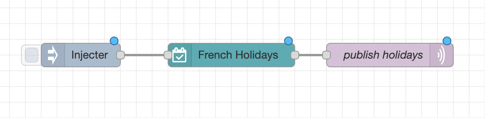

# node-red-french-holidays for node-red

[](https://github.com/tataille/node-red-french-holidays/actions/workflows/node.js.yml)
[](https://github.com/tataille/node-red-french-holidays/graphs/commit-activity)
[](https://opensource.org/licenses/Apache-2.0)
[](https://github.com/tataille/node-red-french-holidays/issues)
[](https://www.npmjs.com/package/@tataille/node-red-french-holidays)

[](https://www.buymeacoffee.com/jeanmarctaz)

A <a href="http://nodered.org" target="_new">Node-RED</a> node to retrieve French School Academy and public holidays depending on School Academy and geo location..

Requires a network connection to retrieve data dynamically from the following official APIs:

* <https://api.gouv.fr/documentation/jours-feries>
* <https://api.gouv.fr/documentation/api-calendrier-scolaire>


## Install

Using the Node Red palette manager.

Alternatively, run the following command in your Node-RED user directory - typically `~/.node-red`


```bash
npm install @tataille/node-red-french-holidays@X.X.X
```

### Update

Use the node-red palette manager to update the module. 


## Usage

Retrieves French School Holiday and Public Holiday based on School Academy, geo location and output them to the next node.

```json
[{"id":"f6f2187d.f17ca8","type":"tab","label":"Exemple Académie Rennes & Fériés Métropole","disabled":false,"info":""},{"id":"69a824ffaab0680b","type":"french-holidays","z":"f6f2187d.f17ca8","name":"Vacances","academy":"Rennes","geo":"Métropole","x":340,"y":240,"wires":[["821c23230cbef1e6"]]},{"id":"821c23230cbef1e6","type":"debug","z":"f6f2187d.f17ca8","name":"","active":true,"tosidebar":true,"console":false,"tostatus":false,"complete":"payload","targetType":"msg","statusVal":"","statusType":"auto","x":550,"y":240,"wires":[]},{"id":"d2702ce52d9c5d50","type":"inject","z":"f6f2187d.f17ca8","name":"","props":[{"p":"payload"}],"repeat":"","crontab":"","once":false,"onceDelay":0.1,"topic":"","payload":"test","payloadType":"str","x":130,"y":240,"wires":[["69a824ffaab0680b"]]}]
```

Data are returned in __msg.payload__

Example of result when querying api on January 2 2024 for Academy of Clermont-Ferrand (Metropole)

```json
{
  "day": 5,
  "isPublicHoliday": false,
  "isTomorrowPublicHoliday": false,
  "publicHolidayName": null,
  "nextPublicHolidayName": "Lundi de Pâques",
  "nextPublicHolidayDate": "01/04/2024",
  "isSchoolHolidays": true,
  "schoolHolidaysEndDate": "03/03/2024",
  "isTomorrowSchoolHolidays": true,
  "schoolHolidaysName": "Vacances d'Hiver",
  "nextSchoolHolidaysCoutdownInDays": 49,
  "nextSchoolHolidaysName": "Vacances de Printemps",
  "nextSchoolHolidaysStartDate": "12/04/2024",
  "nextSchoolHolidaysEndDate": "28/04/2024",
  "schoolPeriod": "2023-2024",
  "year": 2024,
  "region": "Métropole",
  "academy": "Clermont-Ferrand",
  "zones": "Zone A",
  "version": "1.2.0"
}
```

## Examples

### Retrieving data on a daily base


```json
[{"id":"d88debded16f7c16","type":"switch","z":"59b8c1f4183c9197","name":"","property":"day-info.day","propertyType":"global","rules":[{"t":"eq","v":"0","vt":"str"},{"t":"eq","v":"6","vt":"str"},{"t":"else"}],"checkall":"false","repair":false,"outputs":3,"x":190,"y":580,"wires":[["08db052087e131ec"],["08db052087e131ec"],["7b2060ccee5932ce"]]}]
```

### Error handling

Due to the fact the plugin interact with external APIs provided by French government, external errors (missing records, connection errors..) are thrown to the node-red core. To handle the exceptions and program a new query, a __catch__ block must be added to the __node-red__ flow. Error details can be found in the exception message payload.

## Home Assistant Integration

Here is an example of [Home Assistant](https://www.home-assistant.io/) integration using Mqtt & Markdown Card.


### Node-red flow



```json
[
    {
        "id": "eca4106e44139140",
        "type": "tab",
        "label": "HASS French Holidays Integration",
        "disabled": false,
        "info": "",
        "env": []
    },
    {
        "id": "cb07494d2b31865d",
        "type": "french-holidays",
        "z": "eca4106e44139140",
        "name": "French Holidays",
        "academy": "Rennes",
        "geo": "Métropole",
        "x": 340,
        "y": 260,
        "wires": [
            [
                "767f764a21ed6daf"
            ]
        ]
    },
    {
        "id": "767f764a21ed6daf",
        "type": "mqtt out",
        "z": "eca4106e44139140",
        "name": "publish holidays",
        "topic": "home/holidays",
        "qos": "1",
        "retain": "true",
        "respTopic": "",
        "contentType": "application/json",
        "userProps": "",
        "correl": "",
        "expiry": "",
        "broker": "f5fe21bb87d5456d",
        "x": 540,
        "y": 260,
        "wires": []
    },
    {
        "id": "8050191babab6736",
        "type": "inject",
        "z": "eca4106e44139140",
        "name": "",
        "props": [],
        "repeat": "",
        "crontab": "",
        "once": false,
        "onceDelay": 0.1,
        "topic": "",
        "x": 150,
        "y": 260,
        "wires": [
            [
                "cb07494d2b31865d"
            ]
        ]
    },
    {
        "id": "f5fe21bb87d5456d",
        "type": "mqtt-broker",
        "name": "docker mosquitto",
        "broker": "mosquitto",
        "port": "1883",
        "tls": "",
        "clientid": "",
        "autoConnect": true,
        "usetls": false,
        "protocolVersion": "5",
        "keepalive": "60",
        "cleansession": true,
        "birthTopic": "",
        "birthQos": "0",
        "birthPayload": "",
        "birthMsg": {},
        "closeTopic": "",
        "closeQos": "0",
        "closePayload": "",
        "closeMsg": {},
        "willTopic": "",
        "willQos": "0",
        "willPayload": "",
        "willMsg": {},
        "sessionExpiry": ""
    }
]
```

### Home Assistant Sensor

First open your sensor configuration file and add mqtt sensor:

```yaml
mqtt:
  sensor:
    - name: "frenchDaysData"
      state_topic: "home/holidays"
      value_template: '{{ value_json.schoolHolidaysName }}'
      json_attributes_topic: "home/holidays"
      json_attributes_template: '{{ value_json | tojson  }}' 
```

### Markdown

Add a [Markdown Card](https://www.home-assistant.io/dashboards/markdown/) on your dashboard and add the following code.

```javascript

__{{ states.sensor.frenchdaysdata.attributes.schoolHolidaysName }}__ en cours, fin le __{{ states.sensor.frenchdaysdata.attributes.schoolHolidaysEndDate }}__.

Prochain Férié, le __{{ states.sensor.frenchdaysdata.attributes.nextPublicHolidayDate }}__, __{{ states.sensor.frenchdaysdata.attributes.nextPublicHolidayName }}__.

Les prochaines Vacances scolaires pour la __{{ states.sensor.frenchdaysdata.attributes.zones }}__ sont les __{{ states.sensor.frenchdaysdata.attributes.nextSchoolHolidaysName }}__ du __{{ states.sensor.frenchdaysdata.attributes.nextSchoolHolidaysStartDate }}__ au __{{ states.sensor.frenchdaysdata.attributes.nextSchoolHolidaysEndDate }}__.


```

