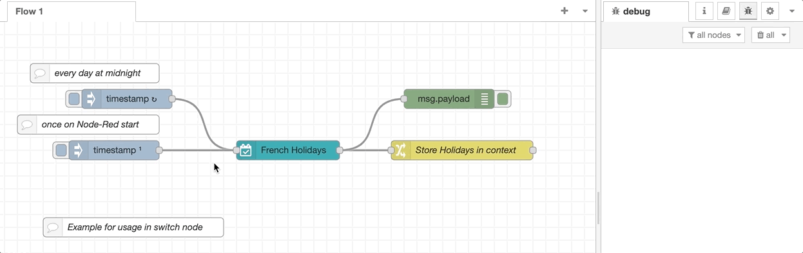
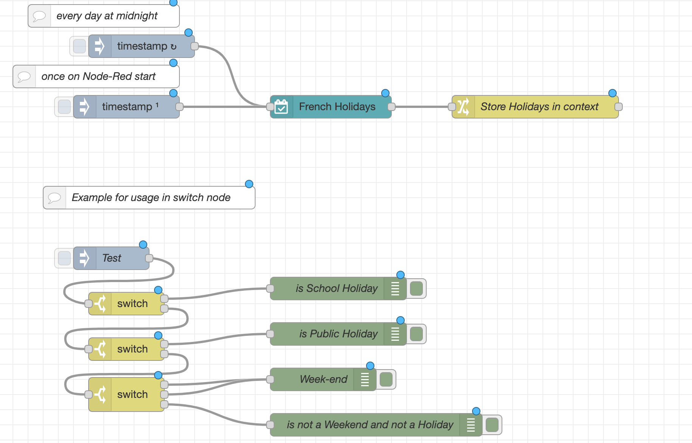

# node-red-french-holidays for node-red

[](https://github.com/rdmtc/node-red-french-holidays/graphs/commit-activity)
[](https://opensource.org/licenses/Apache-2.0)
[](https://github.com/tataille/node-red-french-holidays/issues)
[](https://github.com/tataille/node-red-french-holidays/releases/)

<a href="https://www.buymeacoffee.com/jeanmarctaz"></a>

A <a href="http://nodered.org" target="_new">Node-RED</a> node to retrieve French School Academy and public holidays depending on School Academy and geo location..

Requires a network connection to retrieve data dynmically from the following official APIs:

* <https://api.gouv.fr/documentation/jours-feries>
* <https://api.gouv.fr/documentation/api-calendrier-scolaire>



## Install

Using the Node Red palette manager.

Alternatively, run the following command in your Node-RED user directory - typically `~/.node-red`

```bash
npm install node-red-french-holidays
```

## Usage

Retrieves French School Holiday and Public Holidays based on School Academy, geo location and output them to the next node.

```json
[{"id":"f6f2187d.f17ca8","type":"tab","label":"Exemple Académie Rennes & Fériés Métropole","disabled":false,"info":""},{"id":"69a824ffaab0680b","type":"french-holidays","z":"f6f2187d.f17ca8","name":"Vacances","academy":"Rennes","geo":"Métropole","x":340,"y":240,"wires":[["821c23230cbef1e6"]]},{"id":"821c23230cbef1e6","type":"debug","z":"f6f2187d.f17ca8","name":"","active":true,"tosidebar":true,"console":false,"tostatus":false,"complete":"payload","targetType":"msg","statusVal":"","statusType":"auto","x":550,"y":240,"wires":[]},{"id":"d2702ce52d9c5d50","type":"inject","z":"f6f2187d.f17ca8","name":"","props":[{"p":"payload"}],"repeat":"","crontab":"","once":false,"onceDelay":0.1,"topic":"","payload":"test","payloadType":"str","x":130,"y":240,"wires":[["69a824ffaab0680b"]]}]
```

Data are returned in __msg.payload__

```json
day: 0 // day of the week
isPublicHoliday: true
isTomorrowPublicHoliday: false
publicHolidayName: "1er mai"
nextPublicHolidayName: "8 mai"
nextPublicHolidayDate: "2022-05-08"
isSchoolHoliday: false
isTomorrowSchoolHoliday: false
schoolHolidayName: null
year: 2022
```

## Examples

### Retrieving data on a daily base



```json
[{"id":"f6f2187d.f17ca8","type":"tab","label":"Example Frenh Holidays","disabled":false,"info":""},{"id":"ee7966d41a4eb93a","type":"inject","z":"f6f2187d.f17ca8","name":"","props":[{"p":"payload"},{"p":"topic","vt":"str"}],"repeat":"","crontab":"05 00 * * *","once":false,"onceDelay":0.1,"topic":"","payload":"","payloadType":"date","x":210,"y":120,"wires":[["6cde5e23f714597e"]]},{"id":"6cde5e23f714597e","type":"french-holidays","z":"f6f2187d.f17ca8","name":"French Holidays","academy":"Saint Pierre et Miquelon","geo":"La Réunion","x":460,"y":200,"wires":[["f02f34e5c19dc9ad"]]},{"id":"e4912846.3a1ca8","type":"inject","z":"f6f2187d.f17ca8","name":"","props":[{"p":"payload"},{"p":"topic","vt":"str"}],"repeat":"","crontab":"","once":true,"onceDelay":"1","topic":"","payload":"","payloadType":"date","x":190,"y":200,"wires":[["6cde5e23f714597e"]]},{"id":"d2fe809f.3c90d","type":"switch","z":"f6f2187d.f17ca8","name":"","property":"day-info.isSchoolHoliday","propertyType":"global","rules":[{"t":"true"},{"t":"else"}],"checkall":"true","repair":false,"outputs":2,"x":190,"y":460,"wires":[["c73a89b5.6630f8"],["45f8baa2ab85b321"]]},{"id":"26326493.2e010c","type":"inject","z":"f6f2187d.f17ca8","name":"Test","props":[],"repeat":"","crontab":"","once":false,"onceDelay":0.1,"topic":"","x":170,"y":400,"wires":[["d2fe809f.3c90d"]]},{"id":"c73a89b5.6630f8","type":"debug","z":"f6f2187d.f17ca8","name":"is School Holiday","active":true,"tosidebar":true,"console":false,"tostatus":false,"complete":"payload","targetType":"msg","statusVal":"","statusType":"auto","x":470,"y":440,"wires":[]},{"id":"e245c8da.585928","type":"debug","z":"f6f2187d.f17ca8","name":"is not a Weekend and not a Holiday","active":true,"tosidebar":true,"console":false,"tostatus":false,"complete":"payload","x":520,"y":620,"wires":[]},{"id":"e427d079.51212","type":"comment","z":"f6f2187d.f17ca8","name":"Example for usage in switch node","info":"","x":220,"y":320,"wires":[]},{"id":"16d53221440bd2e4","type":"comment","z":"f6f2187d.f17ca8","name":"every day at midnight","info":"","x":160,"y":80,"wires":[]},{"id":"c5739eb5333cc2d1","type":"comment","z":"f6f2187d.f17ca8","name":"once on Node-Red start","info":"","x":150,"y":160,"wires":[]},{"id":"f02f34e5c19dc9ad","type":"change","z":"f6f2187d.f17ca8","name":"Store Holidays in context ","rules":[{"t":"set","p":"day-info","pt":"global","to":"payload","tot":"msg"}],"action":"","property":"","from":"","to":"","reg":false,"x":730,"y":200,"wires":[[]]},{"id":"45f8baa2ab85b321","type":"switch","z":"f6f2187d.f17ca8","name":"","property":"day-info.isPublicHoliday","propertyType":"global","rules":[{"t":"true"},{"t":"else"}],"checkall":"true","repair":false,"outputs":2,"x":190,"y":520,"wires":[["85d147a3f1f5220f"],["c54de3c014daa901"]]},{"id":"85d147a3f1f5220f","type":"debug","z":"f6f2187d.f17ca8","name":"is Public Holiday","active":true,"tosidebar":true,"console":false,"tostatus":false,"complete":"payload","targetType":"msg","statusVal":"","statusType":"auto","x":470,"y":500,"wires":[]},{"id":"c54de3c014daa901","type":"switch","z":"f6f2187d.f17ca8","name":"","property":"day-info.day","propertyType":"global","rules":[{"t":"eq","v":"0","vt":"str"},{"t":"eq","v":"6","vt":"str"},{"t":"else"}],"checkall":"true","repair":false,"outputs":3,"x":190,"y":580,"wires":[["54181726d58eb31b"],["54181726d58eb31b"],["e245c8da.585928"]]},{"id":"54181726d58eb31b","type":"debug","z":"f6f2187d.f17ca8","name":"Week-end","active":true,"tosidebar":true,"console":false,"tostatus":false,"complete":"payload","targetType":"msg","statusVal":"","statusType":"auto","x":450,"y":560,"wires":[]}]
```

## Development

Start a __node-red__ container.

```bash
    docker run -it -p 1880:1880 -v node_red_data:/data -v $(pwd):/node-red-french-holidays --name nodered nodered/node-red
```

Then connect your VS Code into __nodered__ container

To install the module in "debug" mode

```bash
cd /data/
npm install /node-red-french-holidays/
```

To start the tests

```bash
cd /node-red-french-holidays
npm test
```

Then restart node-red container
