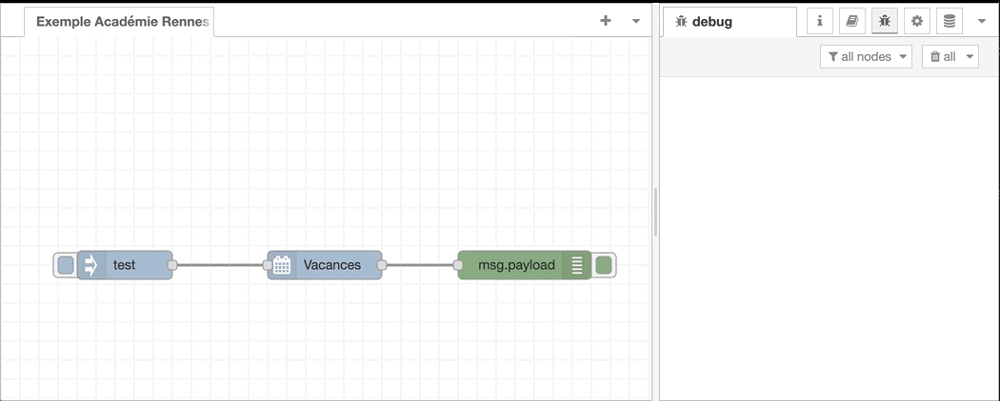

# node-red-french-holiday

<a href="https://www.buymeacoffee.com/jeanmarctaz"></a>

A <a href="http://nodered.org" target="_new">Node-RED</a> node to retrieve French School Academy and public holiday depending on School Academy and geo location..

Requires a network connection to retrieve data dynmically from the following official APIs:

* <https://api.gouv.fr/documentation/jours-feries>
* <https://api.gouv.fr/documentation/api-calendrier-scolaire>



## Install

Using the Node Red palette manager.

Alternatively, run the following command in your Node-RED user directory - typically `~/.node-red`

```bash
npm install node-red-french-holiday
```

## Usage

Retrieves French School Holiday and Public Holiday based on School Academy, geo location and output them to the next node.

```json
[{"id":"f6f2187d.f17ca8","type":"tab","label":"Exemple Académie Rennes & Fériés Métropole","disabled":false,"info":""},{"id":"69a824ffaab0680b","type":"french-holiday","z":"f6f2187d.f17ca8","name":"Vacances","academy":"Rennes","geo":"Métropole","x":340,"y":240,"wires":[["821c23230cbef1e6"]]},{"id":"821c23230cbef1e6","type":"debug","z":"f6f2187d.f17ca8","name":"","active":true,"tosidebar":true,"console":false,"tostatus":false,"complete":"payload","targetType":"msg","statusVal":"","statusType":"auto","x":550,"y":240,"wires":[]},{"id":"d2702ce52d9c5d50","type":"inject","z":"f6f2187d.f17ca8","name":"","props":[{"p":"payload"}],"repeat":"","crontab":"","once":false,"onceDelay":0.1,"topic":"","payload":"test","payloadType":"str","x":130,"y":240,"wires":[["69a824ffaab0680b"]]}]
```

Data are returned in __msg.payload__

```json
day: 0 // day of the week
isPublicHoliday: true
isTomorrowPublicHoliday: false
publicHolidayName: "1er mai"
nextPublicHolidayName: "8 mai"
nextPublicHolidayDate: "2022-05-08"
isSchoolHoliday: false
isTomorrowSchoolHoliday: false
schoolHolidayName: null
year: 2022
```

## Examples

### Retrieving data on a daily base

Retrieve Holiday data every day at 1:00

```json
[{"id":"f6f2187d.f17ca8","type":"tab","label":"Exemple Académie Rennes & Fériés Métropole","disabled":false,"info":""},{"id":"69a824ffaab0680b","type":"french-holiday","z":"f6f2187d.f17ca8","name":"Vacances","academy":"Rennes","geo":"Métropole","x":380,"y":240,"wires":[["821c23230cbef1e6"]]},{"id":"821c23230cbef1e6","type":"debug","z":"f6f2187d.f17ca8","name":"","active":true,"tosidebar":true,"console":false,"tostatus":false,"complete":"payload","targetType":"msg","statusVal":"","statusType":"auto","x":550,"y":240,"wires":[]},{"id":"24579bcb.5c9814","type":"inject","z":"f6f2187d.f17ca8","name":"","props":[{"p":"payload"},{"p":"topic","vt":"str"}],"repeat":"","crontab":"00 01 * * *","once":false,"onceDelay":"","topic":"","payload":"Let's check calendar!!!","payloadType":"str","x":150,"y":240,"wires":[["69a824ffaab0680b"]]}]
```

## Development

```bash
    docker run -it -p 1880:1880 -v node_red_data:/data -v $(pwd):/node-red-french-holiday --name nodered nodered/node-red
    333
```

Then connect your VS Code into __nodered__ container

To install the module in "debug" mode

```bash
cd /data/
npm install /node-red-french-holiday/
```

Then restart node-red container
